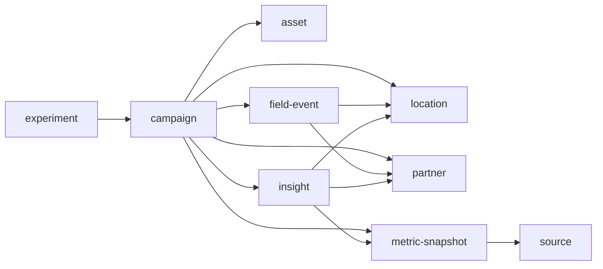

# 데이터 모델

## 노드 유형

| type | 폴더 | 역할 |
| --- | --- | --- |
| `campaign` | `02-campaigns` | 목표와 예산이 있는 실행 단위 |
| `location` | `03-locations` | 물리적 접점과 상권 정보 |
| `partner` | `04-partners` | 제휴/협업/운영 주체 |
| `asset` | `05-assets` | 오프라인 소재와 QR/쿠폰 등 추적 수단 |
| `field-event` | `06-events` | 특정 날짜와 장소에서 일어난 현장 실행 |
| `metric-snapshot` | `06-results` | 성과 수치와 출처 |
| `experiment` | `07-experiments` | 가설 검증형 실행 |
| `insight` | `08-insights` | 반복 가능한 배움과 의사결정 근거 |
| `source` | `01-sources` | 원천 데이터와 수집 방식 |

## 핵심 연결

## 필수 속성

### campaign

- `status`: planned, active, paused, completed, archived
- `objective`: 캠페인의 주 목표
- `start`, `end`: 실행 기간
- `budget`: 총 예산
- `primary_metric`: 핵심 성과 지표

### metric-snapshot

- `period_start`, `period_end`: 집계 기간
- `source`: 원천 데이터 링크
- `campaign`: 캠페인 링크
- `metric_basis`: 집계 기준

### insight

- `confidence`: low, medium, high
- `evidence`: 근거 노트 링크
- `decision`: 적용할 의사결정

## 금지 규칙

- 출처 없는 매출, 리드, 전환 수치를 확정값처럼 쓰지 않는다.
- 한 노트에 캠페인, 장소, 파트너, 성과를 모두 몰아넣지 않는다.
- 같은 장소/파트너가 재사용되면 새로 쓰지 말고 기존 노트에 링크한다.
